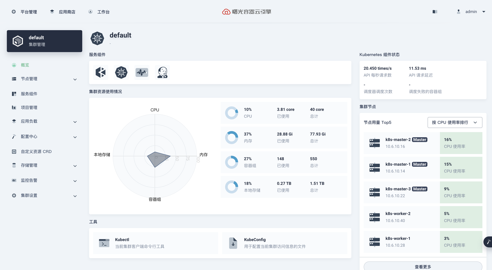

# AppFoundry Console

[](https://gitpod.io/#https://github.com/sugoncloud/appfoundry-console)

[](https://www.gnu.org/licenses/agpl-3.0)

AppFoundry Console is the web-based UI for AppFoundry clusters.



## Getting Started

A KubeSphere cluster is required before getting started.

Read [Installation](https://github.com/kubesphere/kubesphere#installation) guide to install a cluster.

Read [the guide](https://github.com/kubesphere/kubesphere#to-start-using-kubesphere) to start using KubeSphere.

Features Map:


## Developer Guide

### Preparation

Make sure the following software is installed and added to the \$PATH variable:

- A KubeSphere cluster ([Installation](https://github.com/kubesphere/kubesphere#installation))
- Node.js 12.18+ ([installation with nvm](https://github.com/creationix/nvm#usage))
- Yarn 1.22.4+

Install yarn with npm:

```sh
npm install -g yarn
```

Fork the repository, then clone your repository and install the dependencies:

```sh
yarn
```

Note: If you are in China Mainland, execute the following command before running the command above for faster installation.

```sh
yarn config set registry https://registry.npm.taobao.org
```

Alternatively you can start development using docker. See [Development with Docker](/docs/development-with-docker.md).

### Access the backend services of AppFoundry

Follow [the guide](/docs/access-backend.md) to configure the backend services.

### Start AppFoundry Console for development

```sh
yarn start
```

Now, you can access http://localhost:8000 to view the console using the default account admin / P@88w0rd.

### Run tests

```sh
yarn test
```

### Build AppFoundry Console for production

The project can be built for production by using the following task:

```sh
yarn build
```

To build and serve from dist, using the following task:

```sh
yarn serve
```

To build AppFoundry console to an image, run the following task after `yarn build`:

```sh
docker build -t ks-console .
```

Test AppFoundry console image by run:

```sh
./docker-run
```


### Build AppFoundry Console Docker Image

If you don't have NodeJs environment, it's also easy to build the Docker image:

`make image image-push -e REPO=kubespheredev/ks-console`

> Please replace the dockerHub repository to your personal account.

## Development Workflow

Follow [Development Workflow](/docs/development-workflow.md) to commit your codes.

## Support, Discussion, and Community


Please submit any AppFoundry Console bugs, issues, and feature requests to [AppFoundry Console GitHub Issue](https://github.com/kubesphere/console/issues).

## Contributing to the project

Welcome to contribute to AppFoundry Console, see [Contributing Guide](CONTRIBUTING.md).

## License

AppFoundry Console is available under the [AGPL v3 license](LICENSE).

This project is modified open source components which have additional licensing terms in 2021-03-01.  The official source code and licensing terms for these open source components can be found at the following locations:

* KubeSphere Console: [source code](https://github.com/kubesphere/console), [license](https://github.com/kubesphere/console/blob/master/LICENSE)